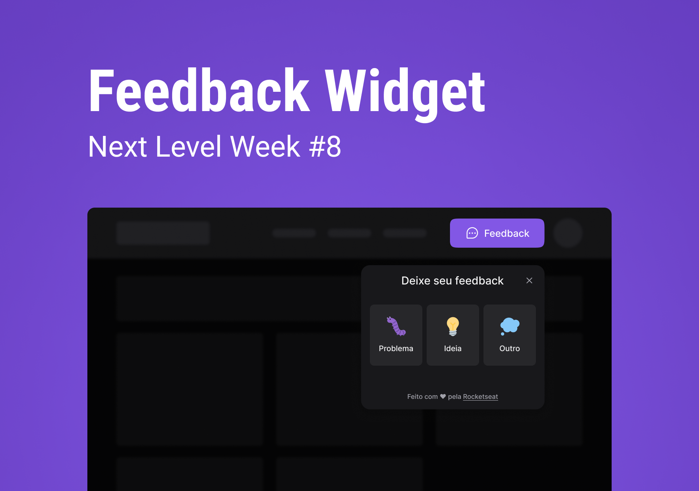

<p align="center">
  <a href="#-tecnologias">🚀 Tecnologias</a>&nbsp;&nbsp;&nbsp;|&nbsp;&nbsp;&nbsp;
  <a href="#-projeto">💻 Projeto</a>&nbsp;&nbsp;&nbsp;|&nbsp;&nbsp;&nbsp;
  <a href="#-executando-o-projeto">🤌 Executando o Projeto</a>&nbsp;&nbsp;&nbsp;|&nbsp;&nbsp;&nbsp;
  <a href="#-layout">🔖 Layout</a>&nbsp;&nbsp;&nbsp;|&nbsp;&nbsp;&nbsp;
  <a href="#memo-licença">📝 Licença</a>
</p>

<p align="center">
 
  
</p>

<br>

<p align="center">
  
</p>

## 🚀 Tecnologias

Esse projeto foi desenvolvido com as seguintes tecnologias:

- React
- Tyoescript
- Tailwind
- Expo
- React Native
- NodeJs
- Prisma ORM
- Jest

## 💻 Projeto

O Feedget é um serviço de feedbacks para que o usuário reporte bugs, possa sugerir features e enviar comentários para a administração de algum app, podendo anexar ao feedback um screenshot da tela para ilustrar o ocorrido.

## 🔖 Layout

Você pode visualizar o layout do projeto através [desse link](https://www.figma.com/community/file/1102912516166573468). É necessário ter conta no [Figma](https://figma.com) para acessá-lo.

## 🤌 Executando o Projeto

### Front-end

Utilize o **yarn** ou o **npm install** para instalar as dependências do projeto.
Em seguida, inicie o projeto.

```cl
npm run dev
```

### Mobile

Utilize o **yarn** ou o **npm install** para instalar as dependências do projeto.
Em seguida, inicie o projeto.

```cl
expo start
```

[doc para configuração do Expo, Expo Go e Andoid Studio](https://efficient-sloth-d85.notion.site/Instalando-Expo-cc5bfac8f19a41e394889e885355f261)

### Backend

Utilize o **yarn** ou o **npm install** para instalar as dependências do projeto.
Em seguida, execute as migrations do banco de dados e após isso inicie o projeto.

```cl
npx prisma migrate dev
```

```cl
npm run dev
```

O projeto utiliza um banco de dados Postgres como provider, caso não queira fazer a instalar, substitua o provider 'postgresql' por 'sqlite' e execite o comando de migrations para gerar o arquivo db.dev

- Lembre-se de clonar os arquivos .env.example e atribuir os valores corretos de DATABASE_URL para o banckend, VITE_API_URL para o frontend e etc.

<p align="center">
  
</p>

## 📝 Licença

Esse projeto está sob a licença MIT. Veja o arquivo [LICENSE](LICENSE) para mais detalhes.

---

Feito com 💙 by Angelo Fernandes
